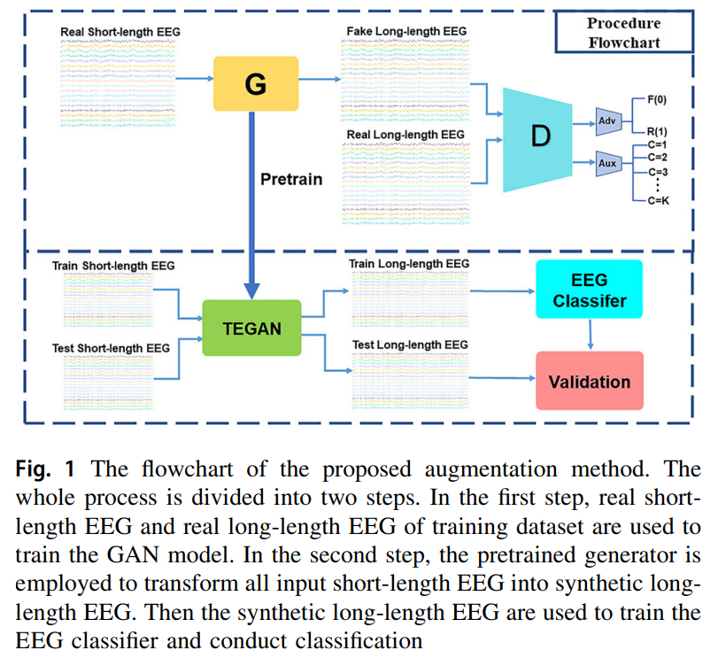

# Introduction
This repository provides source code for replication of TEGAN [1]. As illusted in the following figure, TEGAN consists of a generator and a discriminator. The generator takes short - length SSVEP signals as input and tries to output long-length artificial SSVEP signals. The discriminator is used to distinguish between real long-length SSVEP signals and generated ones. During training, they compete in a zero-sum game. Also, a two-stage training strategy and the LeCam-divergence regularization term are introduced to regulate the training process. TEGAN can improve the performance of traditional frequency recognition methods and deep- learning-based methods under limited calibration data. It shortens the calibration time and reduces the performance gap among various frequency recognition methods, which is beneficial for the development of high-performance BCI systems.



# File Description
- `data/Dial`: A 12-class public SSVEP dataset [2].
- `Model/SSVEPNet.py`: Implementation of CNN-LSTM mixed network with pytorch.
- `Result/DatasetA`: Recorded classification results.
- `Train/Classifier_Trainer.py`: Training code for any DL-based classifier model.
- `Test/SSVEPNet_Test.py`: Evaluating the performance for SSVEPNet.
- `Utils/EEGDataset.py`: Providing the data for intra- and inter- subject experiments.
- `Utils/Constraint.py`: Implementation of spectral normalization and spatial convolution kernel constraint. 
- `Utils/LossFunction.py`: Implementation of visual attention based label smooth techniques.
- `Utils/Ploter`: Plotting histogram to visualize the classification results.

```
pip install -r Resource/requirements.txt
```

# Running Environment
* Setup a virtual environment with python 3.8 or newer
* Install requirements

```
pip install -r Resource/requirements.txt
```


# References
[1] Pan Y, Li N, Zhang Y, et al. Short-length SSVEP data extension by a novel generative adversarial networks based framework[J]. Cognitive Neurodynamics, 2024: 1-21.

[2] Lee M H, Kwon O Y, Kim Y J, et al. EEG dataset and OpenBMI toolbox for three BCI paradigms: An investigation into BCI illiteracy[J]. GigaScience, 2019, 8(5): giz002.

[3] Nakanishi M, Wang Y, Wang Y T, et al. A comparison study of canonical correlation analysis based methods for detecting steady-state visual evoked potentials[J]. PloS one, 2015, 10(10): e0140703.

